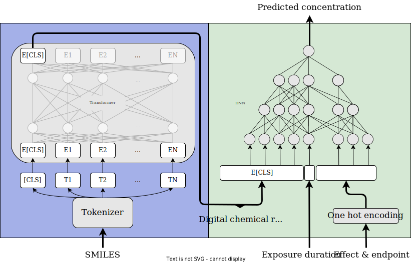

# fishbAIT - fish based AI Toxicity

## Overview
This repository contains all code and data necessary to replicate the results presented in the publication L!.

## How to Use
The models in this repository can also be used directly through our online web application:
[fishbAIT](https://fishbait.streamlit.app/)

For very extensive predictions (>100 MB) consider cloning this repo and follow the tutorials under `tutorials`.

Clone this repository:
```bash 
git clone https://github.com/StyrbjornKall/fishbAIT
```

## Layout
`data` contains all preprocessed data used for training our fine-tuned EC50, EC10 and combined model.

`development` contains all code used to replicate the findings presented in the publication.

`fishbAIT` houses the fine-tuned model parameters

`tutorials` contains tutorial notebooks for running inference using the fine-tuned models.
